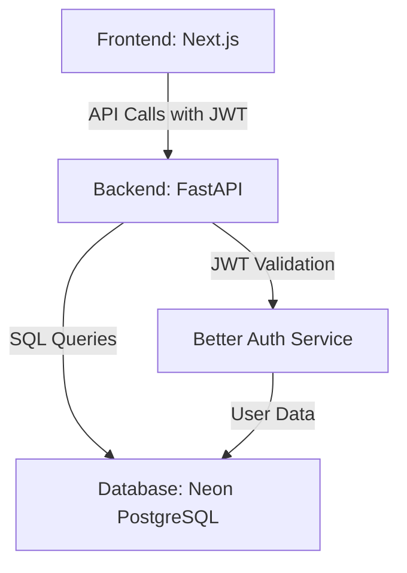

# Implementation Plan: Todo Full-Stack Web Application

**Branch**: `todo-web-app` | **Date**: 2026-01-11 | **Spec**: [link to spec.md]
**Input**: Feature specification from `/specs/todo-web-app/spec.md`

## Summary

Transform the existing console-based todo application into a modern, multi-user web application with persistent storage. The solution will use Next.js for the frontend, FastAPI for the backend, Neon Serverless PostgreSQL for data storage, and Better Auth for authentication with JWT tokens.

## Technical Context

**Language/Version**: Python 3.11+ (FastAPI), JavaScript/TypeScript (Next.js 16+)
**Primary Dependencies**: FastAPI, SQLModel, Next.js, Better Auth, Neon Serverless PostgreSQL
**Storage**: Neon Serverless PostgreSQL with SQLModel ORM
**Testing**: pytest (backend), Jest/React Testing Library (frontend)
**Target Platform**: Web application (desktop and mobile responsive)
**Project Type**: Web application (frontend + backend)
**Performance Goals**: <500ms API response times, <2s initial load, handle 100+ concurrent users
**Constraints**: Data isolation between users, JWT token security, responsive design
**Scale/Scope**: Multi-user system with CRUD operations, authentication, and filtering

## Constitution Check

*GATE: Must pass before Phase 0 research. Re-check after Phase 1 design.*

- ✅ Spec-Driven Development approach followed
- ✅ Agent assignments clearly defined
- ✅ Technology stack aligns with requirements
- ✅ Security considerations included (JWT, data isolation)
- ✅ Performance goals defined

## Project Structure

### Documentation (this feature)

```text
specs/todo-web-app/
├── plan.md              # This file
├── spec.md              # Feature specification
├── research.md          # Technical research findings
├── data-model.md        # Database schema design
├── quickstart.md        # Setup and usage guide
├── contracts/           # API contracts and interfaces
└── tasks.md             # Testable implementation tasks
```

### Source Code (repository root)

```text
# Web application structure
backend/
├── src/
│   ├── models/          # SQLModel data models
│   ├── services/        # Business logic services
│   ├── api/             # FastAPI endpoints
│   ├── auth/            # Authentication middleware
│   └── config/          # Configuration and settings
└── tests/
    ├── unit/            # Unit tests
    └── integration/     # Integration tests

frontend/
├── src/
│   ├── app/             # Next.js App Router pages
│   ├── components/      # Reusable UI components
│   ├── services/        # API service layer
│   ├── context/         # React context providers
│   └── styles/          # CSS/SCSS styling
├── public/             # Static assets
└── tests/
    ├── unit/            # Component tests
    └── e2e/             # End-to-end tests

# Shared configuration
config/
├── database/           # Database connection configs
└── auth/               # Authentication configs

# Root level
package.json           # Frontend dependencies
requirements.txt       # Backend dependencies
Dockerfile             # Containerization
compose.yaml           # Docker Compose for local dev
.env.example           # Environment variables template
```

**Structure Decision**: Web application structure chosen due to clear separation of frontend and backend concerns, with shared configuration for consistency. This structure supports independent development and testing of each layer while maintaining clear interfaces.

## Complexity Tracking

> **Fill ONLY if Constitution Check has violations that must be justified*

| Violation | Why Needed | Simpler Alternative Rejected Because |
|-----------|------------|-------------------------------------|
| Multi-layer architecture | Clear separation of concerns | Monolithic approach would mix frontend/backend logic |
| JWT authentication | Secure multi-user support | Session-based auth less scalable for web apps |
| ORM usage | Database abstraction | Raw SQL would be less maintainable |

## Architecture Overview

### System Components



### Data Flow

1. **User Authentication Flow**:
   - User → Frontend → Better Auth → JWT Token → Frontend → API Calls

2. **Todo Operations Flow**:
   - Frontend → FastAPI (with JWT) → SQLModel → PostgreSQL → Response → Frontend

3. **Data Isolation**:
   - JWT token decoded to get user_id → All database queries filtered by user_id

### API Design

**Base URL**: `/api/v1`

**Endpoints**:
- `POST /auth/signup` - User registration
- `POST /auth/login` - User authentication
- `POST /auth/logout` - User logout
- `GET /todos` - List all todos for authenticated user
- `POST /todos` - Create new todo
- `GET /todos/{id}` - Get specific todo
- `PUT /todos/{id}` - Update todo
- `DELETE /todos/{id}` - Delete todo
- `GET /todos?status={status}` - Filter todos by status

**Authentication**: All endpoints except auth routes require `Authorization: Bearer <JWT>` header

### Database Schema

**Users Table**:
- `id`: UUID (Primary Key)
- `email`: String (Unique)
- `hashed_password`: String
- `created_at`: Timestamp
- `updated_at`: Timestamp

**Todos Table**:
- `id`: UUID (Primary Key)
- `user_id`: UUID (Foreign Key to Users)
- `title`: String (Required)
- `description`: Text (Optional)
- `status`: Enum (active/completed)
- `created_at`: Timestamp
- `updated_at`: Timestamp

**Sessions Table** (for Better Auth):
- `id`: UUID (Primary Key)
- `user_id`: UUID (Foreign Key to Users)
- `token`: String (JWT)
- `expires_at`: Timestamp
- `created_at`: Timestamp

### Security Considerations

1. **Authentication**:
   - JWT tokens with short expiration (1 hour)
   - Refresh token mechanism
   - Secure cookie storage for web

2. **Data Protection**:
   - Password hashing with bcrypt
   - SQL injection prevention via ORM
   - CSRF protection for state-changing operations

3. **API Security**:
   - Rate limiting on auth endpoints
   - CORS restrictions
   - Input validation on all endpoints

### Error Handling

**Frontend Errors**:
- Network errors → User-friendly messages with retry options
- Validation errors → Inline form feedback
- Authentication errors → Redirect to login with error message

**Backend Errors**:
- 400 Bad Request → Invalid input data
- 401 Unauthorized → Missing/invalid JWT
- 403 Forbidden → User trying to access other user's data
- 404 Not Found → Resource doesn't exist
- 500 Internal Server Error → Unexpected server errors

### Performance Optimization

1. **Frontend**:
   - Code splitting with Next.js
   - Lazy loading of components
   - Client-side caching of todos

2. **Backend**:
   - Database connection pooling
   - Query optimization with indexes
   - Response caching for frequent requests

3. **Database**:
   - Indexes on user_id and status fields
   - Proper foreign key constraints
   - Connection pooling configuration

## Implementation Phases

### Phase 1: Foundation Setup
1. Set up project structure
2. Configure Neon PostgreSQL database
3. Implement basic FastAPI backend
4. Set up Next.js frontend
5. Configure Better Auth integration

### Phase 2: Core Functionality
1. Implement user authentication (signup/login/logout)
2. Create todo CRUD API endpoints
3. Build basic todo list UI
4. Implement JWT authentication middleware
5. Set up data isolation by user

### Phase 3: Enhanced Features
1. Add todo filtering (active/completed/all)
2. Implement responsive design
3. Add input validation
4. Implement error handling
5. Add loading states and user feedback

### Phase 4: Testing and Optimization
1. Write unit tests for backend
2. Write integration tests for API
3. Write frontend component tests
4. Perform load testing
5. Optimize performance bottlenecks

### Phase 5: Deployment Preparation
1. Set up Docker containers
2. Configure CI/CD pipeline
3. Set up environment variables
4. Create deployment documentation
5. Perform final security audit

## Risk Analysis

### Top 3 Risks

1. **Authentication Integration**: Better Auth setup and JWT validation
   - **Mitigation**: Use Auth Agent for implementation, test thoroughly
   - **Fallback**: Implement custom JWT handling if needed

2. **Database Performance**: Neon Serverless PostgreSQL latency
   - **Mitigation**: Implement proper indexing, connection pooling
   - **Fallback**: Add caching layer if performance is insufficient

3. **Cross-User Data Leak**: Improper data isolation
   - **Mitigation**: Strict user_id filtering in all queries, comprehensive testing
   - **Fallback**: Add additional security layer with row-level security

## Success Metrics

- ✅ All user stories implemented and tested
- ✅ API response times <500ms for all endpoints
- ✅ 100% data isolation verified through testing
- ✅ Responsive design works on mobile and desktop
- ✅ Authentication flow secure and user-friendly
- ✅ Application handles 100+ concurrent users without degradation